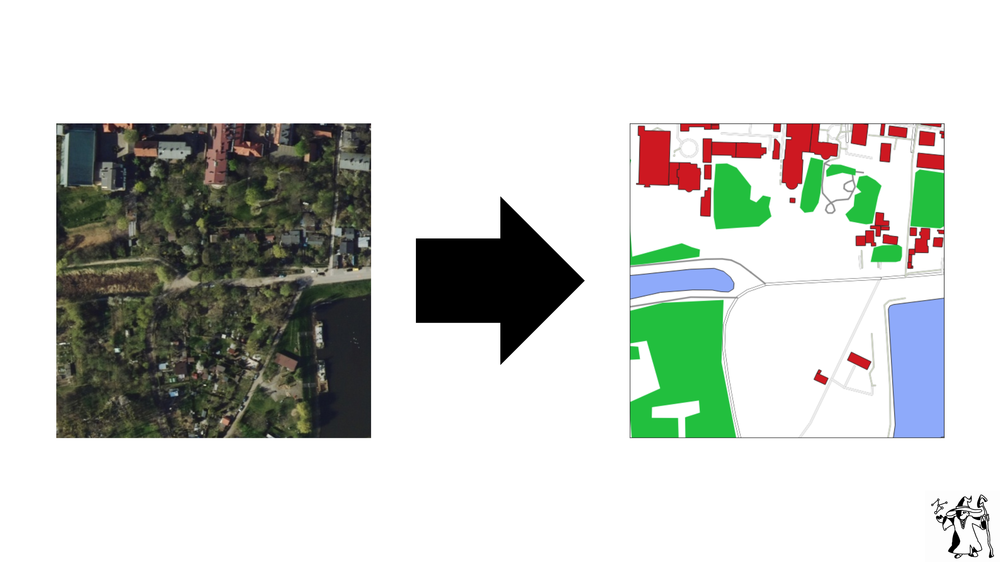

# WAVE3 Magical Drones

Repository with training & data generation code. For demo look here: [link](https://github.com/knsiczarnamagia/wave3-magical-drones-app)

## About The Project
This projects was developed by a team of five Computer Science students as part of a session-long initiative, affectionately referred to as a "project wave," 🌊, under the guidance of the "Czarna Magia" Artificial Intelligence Student Society.

Our primary objective was to create a model capable of converting satellite images into detailed maps. To achieve this, we built our own paired dataset by gathering satellite imagery and maps of Polish cities through [QGIS](https://www.qgis.org/) software, which served as a foundation for training our model. Throughout the project, we investigated several model architectures, including CycleGAN, pix2pix, and GeoGAN. Ultimately, we selected and implemented a CycleGAN-based model, now deployed as a fully functional web application with both frontend and backend integration. 



For model development, we utilized technologies such as Python, PyTorch, PyTorch Lightning, Lightning AI Studio, and Hugging Face. The application was built and deployed using Spring, Java, Postman, and Docker.

We had a privilege of being mentored by Dominik Mielczarek, an experienced ML Engineer from OPEGIEKA, whose expertise and guidance were invaluable to the success of this project.

The final application is publicly accessible — feel free to try it out here: [Magical Drones Vercel App](https://magicaldrones.vercel.app/).

## How to use this repo?

1. Clone repository
```bash
git clone https://github.com/knsiczarnamagia/wave3-magical-drones.git
cd wave3-magical-drones
```

2. Install dependencies (you have to have `make` and `poetry` installed)
```bash
make install 
```

3. Run training (you can change config inside `/conf` dir)
```bash
make train
```


## Compliance with WAVE3 project requirements
1. Types - partialy
2. Linting & formatting - Ruff formatter in GH actions (code must be formatted to be merged to main)
3. CI/CD workflows - version checking, formatter, linter
4. Dependencies & project versioning - Poetry
5. Makefile - make check, make format, make train, make install, make test
6. .gitignore - exists
7. Modular structure - OOP, Pytorch Lightning
8. High quality README - judge for yourself
9. Link to demo - TODO: [link here]
10. Notes and research references - GAN notes (TODO: private?)
11. Usage of `pathlib.Path` - used
12. Datacard - [present in HF dataset](https://huggingface.co/datasets/czarna-magia/mag-map)

## Data generation

Detailed description is [here](./datagen/README.md). In short: pairs of satellite and map images are generated using QGIS software with scripts. Vector layers were downloaded from [Geofabrik](https://download.geofabrik.de/europe/poland.html) and orthophotomaps using [pobieracz_danych_gugik plugin](https://plugins.qgis.org/plugins/pobieracz_danych_gugik/)

## Training 

In this repository we implemented two architectures: [CycleGAN](https://arxiv.org/abs/1703.10593) and [Pix2Pix](https://arxiv.org/abs/1611.07004) using Pytorch Lightning and Hydra for config management. 
Actual training was done on Lightning Studio platform that provides free credits for GPUs. Training runs logging and monitoring was done using W&B library (also weights storing). 
We made some modifications to CycleGAN for our use case (added L1 loss). Without it model didn't align to structure of maps (only style was replicated), so it served as "grounding" for our model.